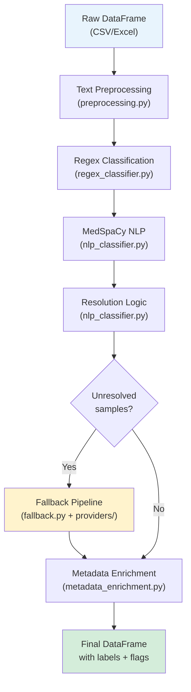

# Architecture Guide

This document provides a deep technical reference for the Paipu Cancer Classification Pipeline. It covers every stage of the pipeline, the responsibility of each module, and the data flow from raw metadata to final classification.

## Table of Contents

- [Pipeline Overview](#pipeline-overview)
- [Data Flow](#data-flow)
- [Module Reference](#module-reference)
- [Classification Labels](#classification-labels)
- [Resolution Logic](#resolution-logic)
- [MedSpaCy Rules System](#medspacy-rules-system)
- [Fallback System](#fallback-system)
- [Metadata Enrichment](#metadata-enrichment)

---

## Pipeline Overview

The pipeline classifies RNA-seq samples as **CANCER** or **NON_CANCER** using a multi-stage approach. Each stage adds information; later stages can override earlier ones when they have higher confidence.

```
┌──────────────┐    ┌──────────────┐    ┌──────────────┐    ┌──────────────┐    ┌──────────────┐
│   1. Regex   │───▶│  2. MedSpaCy │───▶│ 3. Resolution│───▶│ 4. Fallback  │───▶│ 5. Enrichment│
│   Classifier │    │     NLP      │    │    Logic     │    │  (optional)  │    │   Flags      │
└──────────────┘    └──────────────┘    └──────────────┘    └──────────────┘    └──────────────┘
```

**Entry point:** `classify_cancer_samples()` in `functions.py` orchestrates all stages.

---

## Data Flow



### Columns Added at Each Stage

| Stage | Columns Added |
|---|---|
| Regex | `regex_label`, `regex_reason` |
| MedSpaCy | `med_label`, `med_reason`, `med_source_columns` |
| Resolution | `confidence_category`, `resolved_by` |
| Fallback | `fallback_reason` (updates `confidence_category`, `resolved_by`) |
| Enrichment | `is_cell_line`, `is_benign` |

---

## Module Reference

### `config.py` — Central Configuration

The single source of truth for all rules, patterns, and constants.

| Component | Purpose |
|---|---|
| `ClassificationLabel` | Enum of all confidence categories |
| `MedSpaCyLabel` | Enum of MedSpaCy outputs (CANCER, NON_CANCER, NO_SIGNAL) |
| `ClassifierConfig` | Dataclass with column lists and thresholds |
| `RegexPatterns` | Compiled regex for cancer-positive, cancer-negative, and onco-traps |
| `CANCER_RULE_DEFINITIONS` | List of (literal, category, pattern) tuples for MedSpaCy TargetRules |
| `NON_CANCER_RULE_DEFINITIONS` | Same format for non-cancer terms |
| `CONTEXT_RULE_DEFINITIONS` | Negation trigger rules (e.g., "no", "absence of", "non-") |
| `CELL_LINE_PATTERN` | Regex for detecting cell lines |
| `BENIGN_PATTERN` | Regex for detecting benign conditions |

### `functions.py` — Orchestrator Facade

A backward-compatible facade that re-exports all public functions from the split modules. The main function is:

```python
classify_cancer_samples(
    df,                    # Input DataFrame
    nlp_pipeline=None,     # MedSpaCy pipeline (auto-created if None)
    batch_size=64,         # Texts per MedSpaCy batch
    use_normalized=True,   # Use _norm columns
    priority_cols=(...),   # Columns to search
    fallback_providers=None,  # List of FallbackProvider instances
    use_regex=True,        # Enable/disable regex stage
    use_medspacy=True,     # Enable/disable NLP stage
    use_fallback=False,    # Enable/disable fallback stage
) -> pl.DataFrame
```

### `preprocessing.py` — Text Cleaning

- `clean_texts(row, priority_cols)` — Combines text from multiple columns into a single string for NLP processing.
- `normalize_text_column(col_expr)` — Polars expression that lowercases, strips special characters, and normalizes whitespace. Applied once, reused everywhere.
- `identify_candidate_text_columns(df)` — Auto-discovers viable text columns based on non-null percentage and average string length.
- `preprocess_text_columns(df)` — Creates `_norm` suffixed normalized versions of specified columns.

### `regex_classifier.py` — Pattern Matching

`apply_regex_classification(df, priority_cols, use_normalized)`:

1. Checks each priority column for cancer-positive and cancer-negative regex matches.
2. Counts mentions across columns (`n_cancer_mentions`, `n_negative_mentions`).
3. Distinguishes **sample-level** signals (`source_name`, `tissue`) from **study-level** signals (`title`).
4. Applies a cascading `WHEN/THEN` logic to assign `regex_label`.
5. Builds a human-readable `regex_reason` string.

Key design choice: Sample-level control/normal signals override study-level cancer signals. A sample with `source_name="normal tissue"` from a cancer study is classified as non-cancer.

### `nlp_classifier.py` — MedSpaCy NLP

Two main functions:

**`_classify_doc(doc)`** — Classifies a single spaCy Doc:
- Counts cancer entities, non-cancer entities, and negated cancer entities.
- If all cancer entities are negated → NON_CANCER.
- If negated count > affirmed count → NON_CANCER.
- If any affirmed cancer → CANCER.
- If only non-cancer terms → NON_CANCER.
- Otherwise → NO_SIGNAL.

**`medspacy_classify_batch(df, nlp_pipeline, ...)`** — Processes the full DataFrame:
- Iterates each row, processing each priority column individually.
- Tracks which columns contain cancer entities (`med_source_columns`).
- Concatenates all column texts and classifies the combined result.

**`resolve_uncertain(regex_label, med_label, med_source_columns)`** — Combines results:
- See [Resolution Logic](#resolution-logic) below.

### `pipeline.py` — MedSpaCy Singleton

Manages a singleton MedSpaCy pipeline instance:

- `get_nlp()` — Returns the shared pipeline (creates it on first call).
- `NLPPipelineManager` — Singleton class with `get_pipeline()`, `add_rules()`, `reset()`, `get_rule_count()`.
- `generate_disease_rules(unique_diseases, nlp, existing_rules)` — Auto-generates TargetRules from disease column values.

### `text_column_processing.py` — Column Tiering

Organizes DataFrame columns into three tiers:

| Tier | Description | Examples |
|---|---|---|
| Priority | Always processed | `title`, `source_name`, `tissue`, `disease`, `cell_type` |
| Secondary | Processed if present | `sample_name`, `condition`, `health_state` |
| Discovered | Auto-detected by heuristics | Columns with sufficient non-null % and avg string length |

`preprocess_dataframe(df, config)` runs the full preprocessing pipeline and creates `_norm` columns.

### `fallback.py` — Fallback Pipeline

See [Fallback System](#fallback-system).

### `metadata_enrichment.py` — Post-Classification Flags

Adds boolean columns by scanning configurable sets of text columns for regex patterns:

- `is_cell_line` — Matches 50+ known cell line names (HeLa, 4T1, B16, etc.) and phrases like "cell line".
- `is_benign` — Matches "benign", "non-malignant", etc.

---

## Classification Labels

### Internal Labels (confidence_category)

```
confident_cancer        ── Regex + MedSpaCy both agree: cancer
likely_cancer           ── Probable cancer, minor ambiguity
confirmed_by_medspacy   ── Regex uncertain, MedSpaCy found cancer
confirmed_non_cancer    ── No cancer signal or confirmed negative
likely_non_cancer       ── Negative context detected
```

### Final Label Mapping

The internal labels map to a binary output for downstream use:

```python
{
    "confident_cancer":      "CANCER",
    "likely_cancer":         "CANCER",
    "confirmed_by_medspacy": "CANCER",
    "confirmed_non_cancer":  "NON_CANCER",
    "likely_non_cancer":     "NON_CANCER",
}
```

### `resolved_by` Column

Tracks which stage made the final determination:

| Value | Meaning |
|---|---|
| `regex` | Regex had a clear signal, MedSpaCy had no signal |
| `medspacy` | Regex was uncertain, MedSpaCy resolved it |
| `regex+medspacy` | Both stages contributed |
| `default` | Neither stage found anything; defaulted to non-cancer |
| `expanded_search` | Fallback: found terms in non-priority columns |
| `ncbi_api` | Fallback: NCBI BioProject metadata had cancer terms |
| `gemini_llm` / `ollama_llm` | Fallback: LLM classified the sample |

---

## Resolution Logic

The `resolve_uncertain()` function in `nlp_classifier.py` combines regex and MedSpaCy results. The key insight is distinguishing **sample-level** columns (describe the physical sample) from **study-level** columns (describe the research project).

```
Study-level only = {title, diagnosis, cell_type}
Sample-level     = everything else (source_name, tissue, disease, ...)
```

### Decision Tree

```
IF regex = confident_cancer:
    → confident_cancer (regex is definitive)

IF regex = likely_non_cancer:
    IF medspacy = CANCER AND cancer found in sample-level columns:
        → confirmed_by_medspacy (sample evidence overrides)
    ELSE:
        → confirmed_non_cancer (sample-level non-cancer prevails)

IF regex = likely_cancer:
    IF medspacy = CANCER: → likely_cancer
    IF medspacy = NON_CANCER: → likely_non_cancer
    ELSE: → likely_cancer (benefit of the doubt)

IF regex = uncertain_*:
    IF medspacy = CANCER: → confirmed_by_medspacy
    IF medspacy = NON_CANCER: → confirmed_non_cancer
    ELSE: → confirmed_non_cancer (default to non-cancer)
```

---

## MedSpaCy Rules System

### TargetRules

TargetRules define what entities the NLP pipeline can detect. Each rule has:
- **literal** — Exact text match (e.g., `"osteosarcoma"`)
- **category** — Entity label (`CANCER` or `NON_CANCER`)
- **pattern** — Optional regex pattern for flexible matching (e.g., `r"\btumou?rs?\b"`)

Rules are defined as tuples in `config.py` (`CANCER_RULE_DEFINITIONS`, `NON_CANCER_RULE_DEFINITIONS`) and converted to `TargetRule` objects in `pipeline.py`.

### ConTextRules (Negation)

ConTextRules define how the pipeline detects negation. Each rule has:
- **literal** — The trigger phrase (e.g., `"no evidence of"`)
- **category** — Always `NEGATED_EXISTENCE`
- **direction** — `FORWARD` (negates entities after the trigger) or `BACKWARD` (negates entities before)

Current negation triggers include:
`non-`, `no`, `without`, `absence of`, `free of`, `negative for`, `no evidence of`, `ruled out`, `denies`, `denied`.

### Auto-Generated Rules

`generate_disease_rules()` dynamically creates additional TargetRules from unique values in the `disease` column of the dataset. This ensures the pipeline recognizes dataset-specific disease terms not covered by the default rules.

---

## Fallback System

The fallback system uses a **provider chain** pattern. Each provider implements the `FallbackProvider` abstract class with a `classify(sample)` method. The `FallbackPipeline` orchestrator:

1. Identifies unresolved samples (`confirmed_non_cancer` + `no_relevant_terms`).
2. Passes them through providers in order.
3. Stops at the first provider that returns a resolved result (confidence ≥ 0.5).

### Built-in Providers

| Provider | Module | Description |
|---|---|---|
| `ExpandedSearchProvider` | `fallback.py` | Scans ALL text columns (not just priority) for cancer terms |
| `NCBIProvider` | `providers/ncbi.py` | Fetches BioProject metadata from NCBI E-utilities; disk-cached |
| `GeminiProvider` | `providers/llm.py` | Google Gemini API classification with retry/rate-limit handling |
| `OllamaProvider` | `providers/llm.py` | Local LLM classification via Ollama REST API |

### Usage

```python
from fallback import ExpandedSearchProvider
from providers import NCBIProvider, GeminiProvider

providers = [
    ExpandedSearchProvider(nlp_pipeline=nlp),
    NCBIProvider(email="your@email.com"),
    GeminiProvider(api_key="your-key"),
]

results = classify_cancer_samples(
    df,
    fallback_providers=providers,
    use_fallback=True,
)
```

---

## Metadata Enrichment

After classification, `enrich_metadata()` adds two boolean flags:

### `is_cell_line`

Scans columns (`cell_line`, `cell_type`, `source_name`, `model`, `tumor_type`, `title`, etc.) for:
- Explicit phrases: "cell line", "cell culture"
- Named cell lines: HeLa, HEK-293, MCF-7, MDA-MB, A549, 4T1, B16, CT26, etc.
- 50+ mouse, human, rat, and canine cell line patterns

### `is_benign`

Scans columns (`disease`, `source_name`, `tissue`, `phenotype`, `tumor_type`, `title`, `cell_type`) for:
- "benign", "non-malignant", "benign tumor/neoplasm/lesion/growth"

Both flags use the same `_detect_flag()` internal function, which normalizes text and checks for regex matches across multiple columns.
